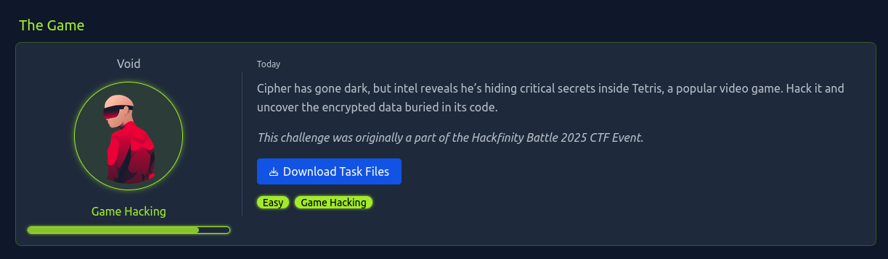
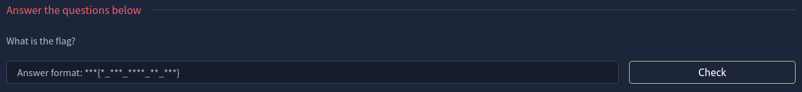

# The Game

## 📋 Challenge Info
- **Platform**: [TryHackMe](https://tryhackme.com)
- **Room**: [The Game](https://tryhackme.com/room/hfb1thegame) 
- **Difficulty**: 🟢 Easy
- **Category**: 🔧 Reverse Engineering
- **Tags**: `reverse`, `.exe`, `hard-coded-string`

### Challenge Description


### 📌 Goal


## 📥 Step 1: Download and Extract
Download and extract the challenge files:
```shell
$ unzip Downloads/Tetrix.zip -d tetris 
$ cd tetris && ls -lah
total 89M
drwxr-xr-x  3 user user 4.0K Feb  7 12:17 .
drwx------ 28 user user 4.0K Feb  7 12:17 ..
drwxr-xr-x  2 user user 4.0K Feb  7 12:17 __MACOSX
-rw-rw-rw-  1 user user  89M Mar 14  2025 Tetrix.exe
```

## 🔍 Step 2: Initial File Analysis
Our target is `Tetris.exe`. Check this file using `file` and `strings` utilities(looking for the hard-coded flag pattern `THM{}`):
```shell
# Determine file type
$ file Tetrix.exe
Tetrix.exe: PE32+ executable for MS Windows 5.02 (GUI), x86-64 (stripped to external PDB), 13 sections

# Search for flag pattern
$ strings Tetrix.exe | grep -i "thm{"
THM{I_CAN_READ_IT_ALL}
```

## 🚩 Flag
`THM{I_CAN_READ_IT_ALL}`

---

## 🛡️ Security Recomendations
- Never store secrets in plain text within binaries
- For better security, use:
    - Environment Variables
    - Encrypted Configuration Files
    - Code Obfuscation Tools
    - Runtime Calculation