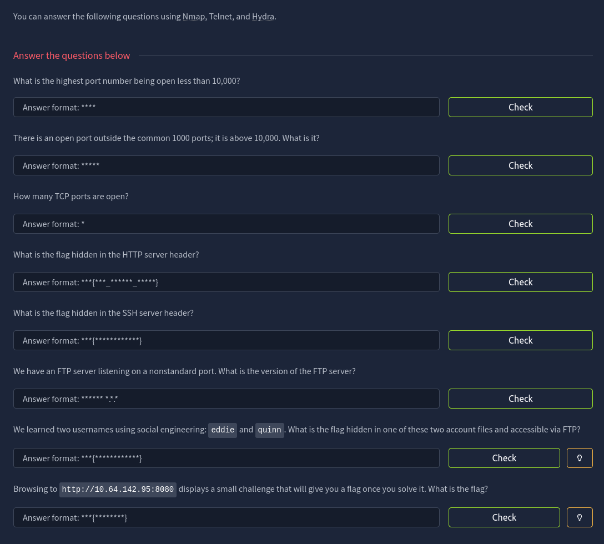
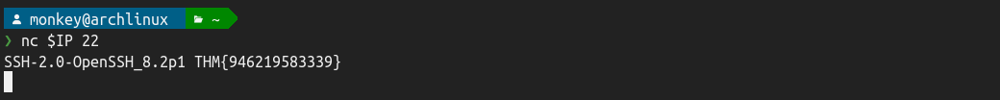
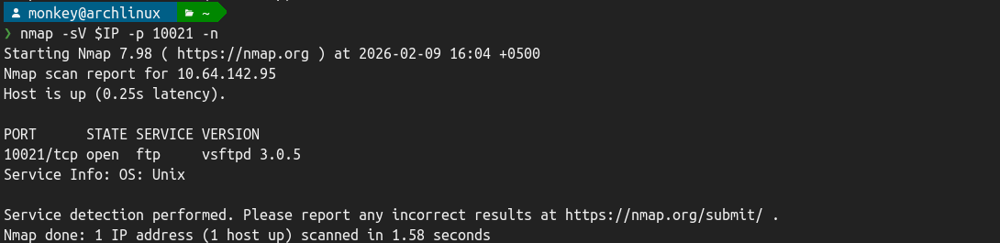
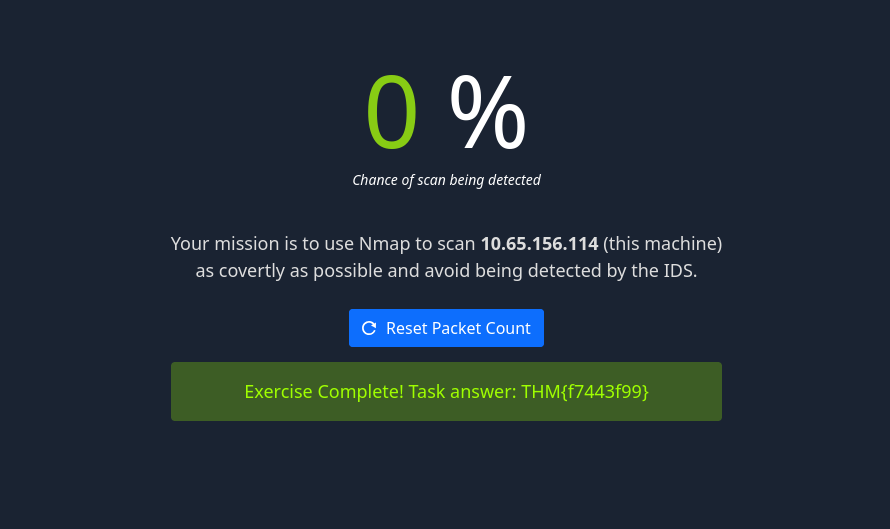

# Net Sec Challenge

## 📋 Challenge Info
- **Platform**: [TryHackMe](https://tryhackme.com)
- **Room**: [Net Sec Challenge](https://tryhackme.com/room/netsecchallenge) 
- **Difficulty**: 🟡 Medium
- **Category**: 🌐 Web & Network
- **Tags**: `port_scanning`, `service_enumeration`, `password_attack`, `nmap`, `hydra`, `nc`

### Challenge Description
> This challenge tests your mastery of network reconnaissance and service enumeration techniques using only three essential tools: `nmap`, `telnet`, and `hydra`. Apply your skills to uncover hidden flags across multiple network services.



## 🔍 Step 1: Analysing questions
I'll use a single `nmap` command with `-p-` and `-T4` flags to quickly identify all open ports and answer the first three questions. Skipping version detection (`-sV`) and scripts (`-sC`) speeds up the scan while still providing the port information needed for questions 1-3.  
For Question 6 (FTP version), I'll run a separate scan with -sV on just the FTP port found. This saves time compared to scanning all ports with version detection.

## Step 2. Questions
### Questions 1-3
```shell
$ IP=10.64.142.95 # used as environment variable throughout the challenge
$ sudo nmap -Pn -n -v -T4 -p- $IP
```


**1. What is the highest port number being open less than 10,000?**  
🚩 *ANSWER*: `8080`

**2. There is an open port outside the common 1000 ports; it is above 10,000. What is it?**  
🚩 *ANSWER*: `1021`

**3. How many TCP ports are open?**  
🚩 *ANSWER*: `6`

### Question 4
**4. What is the flag hidden in the HTTP server header?**  
🚩 *ANSWER*: `lighttpd THM{web_server_25352}`  


### Question 5
**5. What is the flag hidden in the SSH server header?**  
🚩 *ANSWER*: `THM{946219583339}`  


### Question 6
**6. We have an FTP server listening on a nonstandard port. What is the version of the FTP server?**  
After `nmap` scan we remember port `10021`. Check it.  
🚩 *ANSWER*: `vsftpd 3.0.5`    


### Question 7
**7. We learned two usernames using social engineering: `eddie` and `quinn`. What is the flag hidden in one of these two account files and accessible via FTP?**  
Will use `hydra`. Create `user-ftp.txt` for logins in `hydra`:
```shell
echo -e "eddie\nquinn" > users-ftp.txt
```  
Use `hydra` and receive credentials:
```shell
hydra -L users-ftp.txt -P /usr/share/seclists/Passwords/Leaked-Databases/rockyou-50.txt ftp://$IP:10021
```  
  

Trying `eddie`(🔴 Empty):  


Trying `quinn`(🟢 Found):  
   
🚩 *ANSWER*: `THM{321452667098}`  

### Question 8
**8. Browsing to http://10.64.142.95:8080 displays a small challenge that will give you a flag once you solve it. What is the flag?**   
By trial and error, I came to the conclusion that using `Null scan` is the right option.
```shell
sudo nmap -sN -n -v $IP 
```  
  
🚩 *ANSWER*: `THM{f7443f99}`
